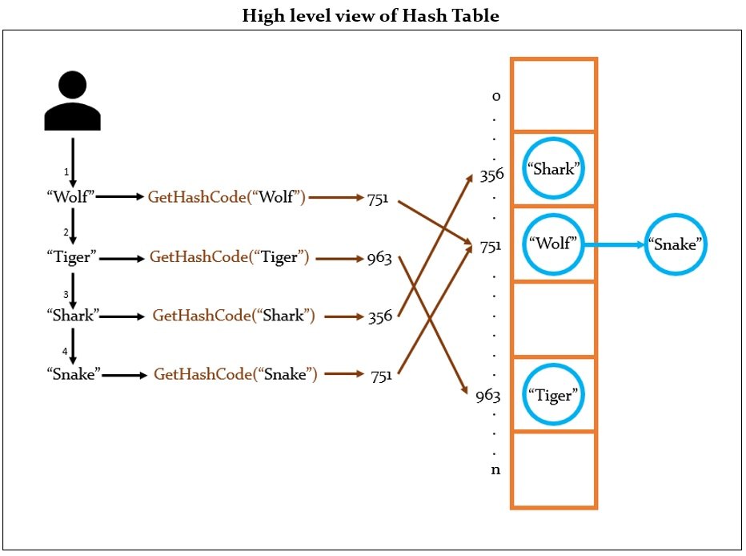

# Hash Table
## What is a Hash Table?
Hash Table is a data structure which stores data in an associative manner. In a hash table, data is stored in an array format, where each data value has its own unique index value. This index value is obtained through a hash function which receives the data value as input and tries to return a unique hash code as output. Thus, This data structure is very fast for data search, insert and removal operations since you can directly access the data using the index generated by the hash function.

Ideally the hash code should be unique and unrepeatable for each input. But this will depend on how effective the hash function is. Therefore, every time 2 different inputs return the same hash code, a collision will be generated. A hash table must withstand collisions, and one of its solutions is to implement a linked list at each position in the array.

## Advantages

## Disadvantages

## Hash Table operations and Time Complexity
| Operation    | Time Complexity |
| ------------ | --------------- |
| AddFront     | O(1)            |
| DeleteFront  | O(1)            |
| AddBack      | O(1)            |
| DeleteBack   | O(1)            |
| Search       | O(n)            |
| Nth          | O(n)            |

## Real life examples
A Hash Table is good for:
* 

## Code explanation

## TODO
- 