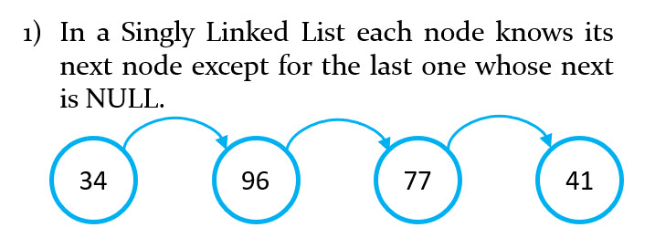
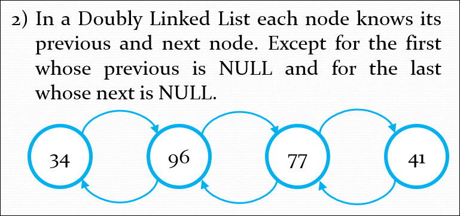
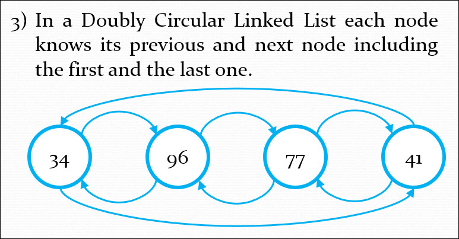

# Linked List
## Definition
A linked list is a linear data structure. It consists of a sequence of nodes where each node keeps data and 1 or 2 pointers to previous or nexts nodes. A linked list is a self-referenced data type because it contains a link to another data of the same type.

TODO mentions Queue and Stack

## Some variants
<table border="1" background>
    <tr>
        <td></td>
        <td></td>
    </tr>
    <tr>
        <td></td>
        <td></td>
    </tr>
</table>

Advantages
Disadvantages
Time complexity
