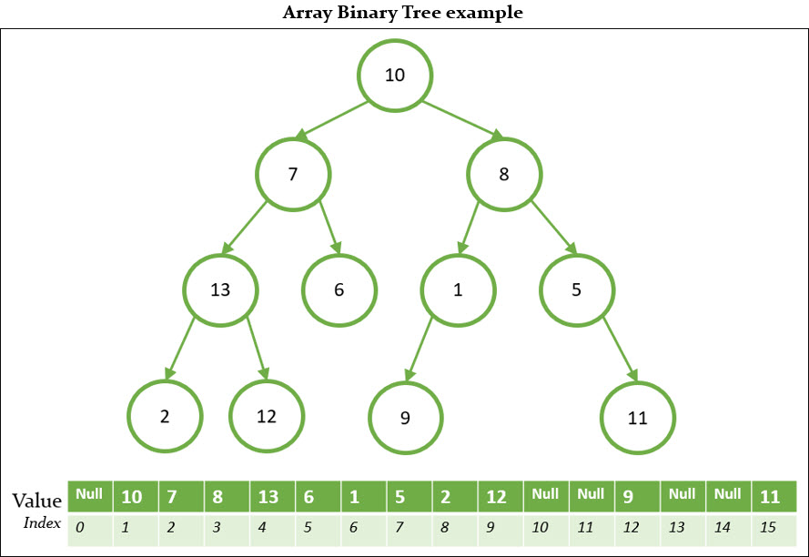
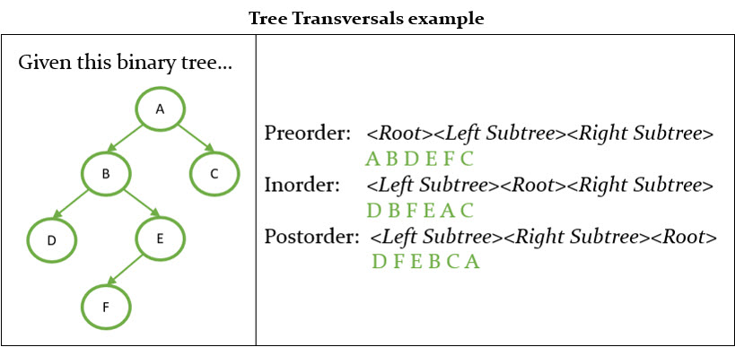

# Array Binary Tree
A binary tree is basically a tree in which each node can have from 0 up to 2 children as the limit. Binary Trees are ideal to go with a hierarchical way of storing data. Reflect structural relationships that exist in the given data set. 

There are many ways to implement binary trees in the code, one of them is by using an Array. Then, we will show some simple formulas to explain how.
#### Formulas
- Root = index 1
- Left Node = index*2
- Right Node = index*2+1
- Ancestor = index/2
- Number of nodes = (2^N)-1

These formulas just work if we start at index 1 of the array.

Each is node is stored in a specific position of the array. Basically, this is an Array of Nodes. The implementation using Array is not good for deletion due to the nature of the Arrays, which makes it difficult to maintain the structure with this action.

## Binary Trees operations and Time Complexity
| Operation        | Time Complexity |
| ---------------- | --------------- |
| Insert           | O(n)            |
| Count            | O(n)            |
| CalculateHeight  | O(n)            |
| Delete           | O(n)            |
| Search           | O(n)            |
| ShowInOrder      | O(n)            |
| ShowPreOrder     | O(n)            |
| ShowPostOrder    | O(n)            |

Binary Tree is unordered hence slower in process of insertion, deletion, and searching. Also, in a Binary Tree, there is no ordering in terms of how the nodes are arranged. You'll see how these time complexities enhance with the different kinds of Binary Trees.

## Tree Transversals

## Code explanation

## TODO
- Explain the relation with the code.
