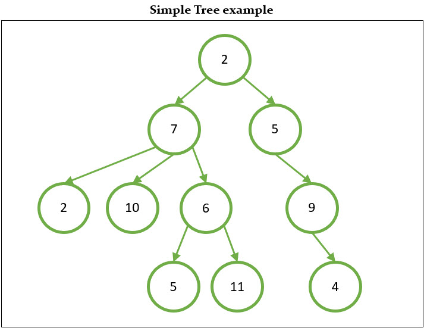
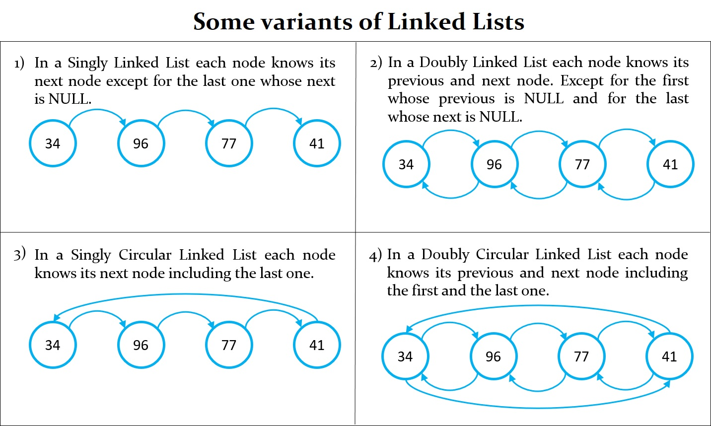

# Tree
## What is a Tree?

A tree is a hierarchical structure that starts with a node called Root. With this root and subtrees of children with a parent node, represented as a set of linked nodes. A tree data structure can be defined recursively as a collection of nodes, where each node is a data structure consisting of a value and a list of references to nodes. The start of the tree is the "root node" and the reference nodes are the "children". No reference is duplicated and none points to the root.

It is an undirected, connected and acyclic graph. A graph is a set of vertices and edges.

## Arbol K-ario

## Terminology
- Leaf Node: node with no children.
- Branch: path from the Root to a Leaf Node.
- Length: number of nodes in a Branch.
- Height: length of the largest Branch.
- Root: Ancestor of all the tree's nodes.
- Ancestor: If the path from N to the Root passes through M, then M is Ancestor of N.

## Code explanation

## TODO
- 
