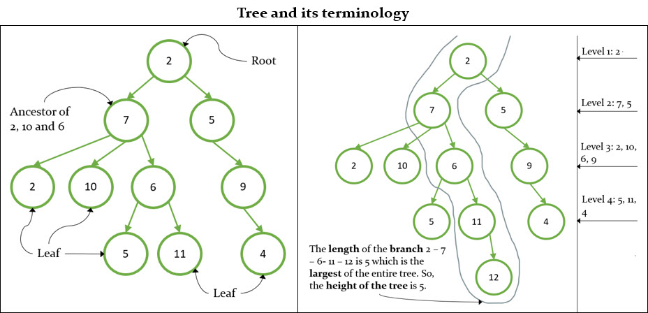
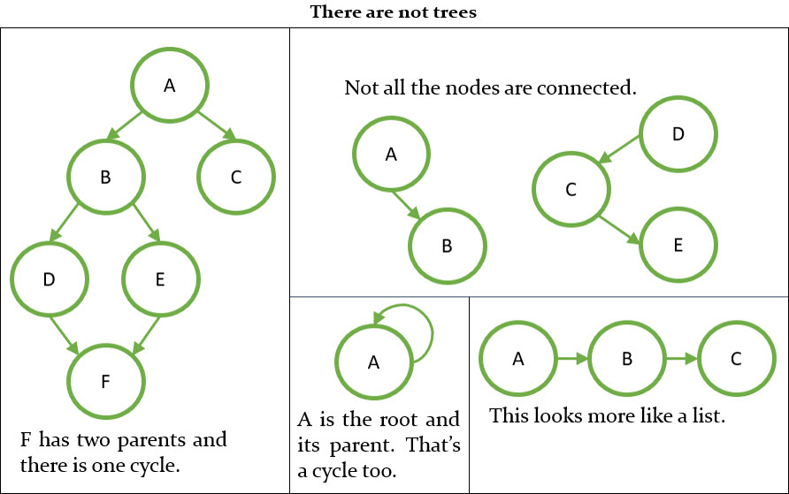

# Tree
## What is a Tree?

A tree is a hierarchical structure that starts with a node called Root. With this root and subtrees of children with a parent node, represented as a set of linked nodes. A tree data structure can be defined recursively as a collection of nodes, where each node is a data structure consisting of a value and a list of references to nodes. The start of the tree is the "root node" and the reference nodes are the "children". No reference is duplicated and none points to the root.

### Terminology
- Leaf Node: node with no children.
- Branch: path from the root to a leaf node.
- Length: number of nodes in a branch.
- Height: length of the largest branch.
- Level: the level of a node n is the number of edges on the path from the root node to n.
- Root: ancestor of all the tree's nodes.
- Ancestor: if the path from n to the root passes through m, then m is ancestor of n.

A tree must be:
- Undirected: a tree is an undirected graph in which any two vertices are connected by exactly one path.
- Connected: a tree is a connected graph in which all its vertices are connected by a path.
- Acyclic: a tree is a acyclic graph when it does not contain cycles.

## TODO
- 
